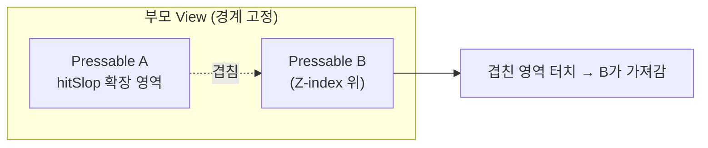
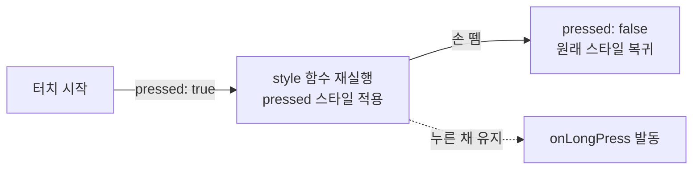
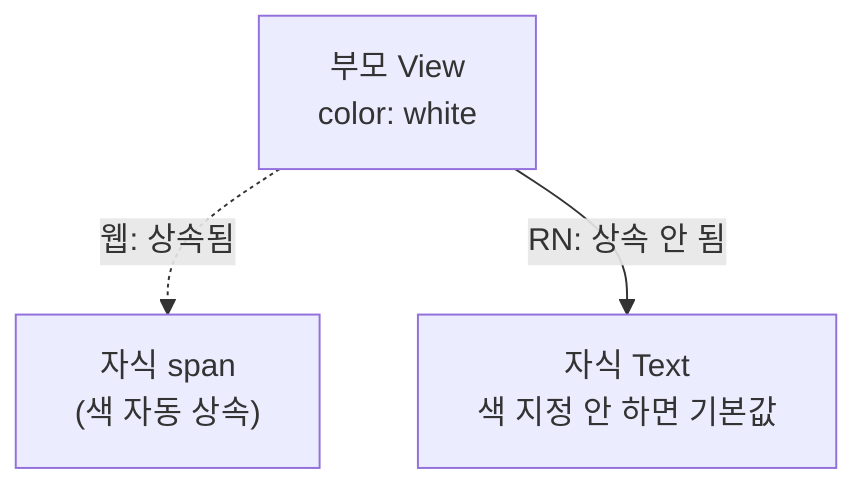
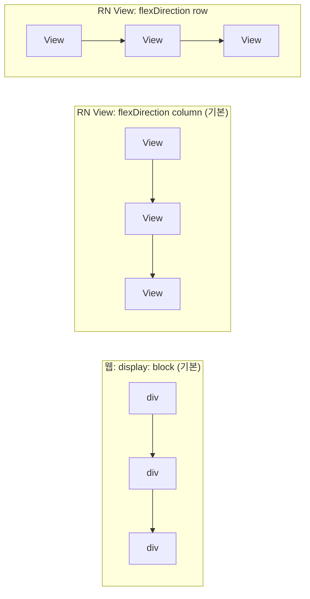

# P1 학습 가이드 — RN 멘탈모델 & Core Components

> 대상 실습: 프로필 카드 (`rn-sandbox/App.tsx`)
> 출처: [The Basics](https://reactnative.dev/docs/getting-started) · [Core Components and APIs](https://reactnative.dev/docs/components-and-apis)
> 검증: iOS 시뮬레이터 / Android 에뮬레이터 실행 확인
> 대상 독자: **웹 React 숙련자.** JS/hooks/상태·이벤트는 웹과 동일하므로 스킵하고, **웹과 다른 지점만** 정리.

핵심 한 줄: **상태·이벤트·컴포넌트 로직은 웹 React 그대로. 다른 건 "무엇으로 그리고, 어떻게 스타일하느냐" 뿐.**

---

## 1. DOM이 없다 — Core Components

HTML 태그(`div`/`span`/`p`/`img`)가 아예 없다. `react-native`에서 **import한 컴포넌트만** 화면에 그린다.

| 웹 HTML            | RN Core Component | 비고                    |
| ------------------ | ----------------- | ----------------------- |
| `<div>`            | `<View>`          | 레이아웃 컨테이너       |
| `<span>` `<p>`     | `<Text>`          | 모든 텍스트는 여기 안에 |
| ``            | `<Image>`         | `source` prop           |
| 스크롤되는 `<div>` | `<ScrollView>`    | 스크롤 명시 필요        |
| `<input>`          | `<TextInput>`     |                         |
| `<button>`         | `<Pressable>`     | `onPress`               |

```tsx
import {
  View,
  Text,
  Image,
  ScrollView,
  Pressable,
  StyleSheet,
} from "react-native";
```

## 2. 반드시 지켜야 할 규칙 3개

### (1) 모든 텍스트는 `<Text>` 안에

```tsx
<View>하승</View>          // ✕ 런타임 에러: "Text strings must be rendered within a <Text>"
<View><Text>하승</Text></View>  // ✓
```

웹은 `<div>하승</div>`이 되지만 RN은 문자열을 View에 직접 넣으면 에러다.

### (2) `<Image>`는 크기와 `{uri}`가 필수

```tsx
<Image style={styles.avatar} source={{ uri: USER.avatar }} />
// avatar: { width: 120, height: 120, borderRadius: 60 }
```

- 원격 이미지는 `source={{ uri: "..." }}` (문자열 아님, 객체).
- **width/height 없으면 안 보인다.** 웹 ``는 원본 크기로 알아서 뜨지만, RN은 크기를 명시해야 렌더된다(비동기 로드라 크기를 미리 알 수 없어서).
- `borderRadius: width/2` = 원형.

### (3) 스크롤은 `<ScrollView>`로 명시

```tsx
<ScrollView style={styles.screen} contentContainerStyle={styles.content}>
```

웹은 `body`가 내용이 길면 자동 스크롤. RN은 **명시적으로** ScrollView(또는 FlatList 등 리스트)를 써야 스크롤된다. `style`은 스크롤 뷰 자체, `contentContainerStyle`은 안쪽 내용에 적용(둘의 구분 중요).

> ⚠️ ScrollView는 자식을 **전부 한 번에 렌더**. 아이템이 많으면 P4의 FlatList(가상화)를 써야 한다. ScrollView는 개수가 적고 고정된 내용에만.

### 2-1. TextInput 기본 프롭

```tsx
<TextInput
  style={styles.input}
  value={email}
  onChangeText={setEmail}
  placeholder="you@example.com"
  keyboardType="email-address"
  secureTextEntry={false}
/>
```

- 웹 `<input value onChange>`와 짝: RN은 **`value` + `onChangeText`**(이벤트 객체가 아니라 문자열을 바로 준다).
- `placeholder`가 웹의 placeholder 역할(별도 label 아님, 값 아님).
- `keyboardType`(`"email-address"`/`"numeric"`/`"phone-pad"` 등)으로 OS 키보드 종류 지정.
- `secureTextEntry`가 웹의 `type="password"` 대응.
- react-hook-form과 엮은 실전 폼은 P6에서 다룸 — 여기서는 TextInput 단독 사용법만.

## 3. `onPress` (not `onClick`)

```tsx
<Pressable
  style={[styles.button, following && styles.buttonActive]}
  onPress={() => setFollowing((v) => !v)}
>
  <Text>{following ? "팔로잉" : "팔로우"}</Text>
</Pressable>
```

- 이벤트는 `onClick`이 아니라 **`onPress`**. RN엔 마우스가 아니라 터치.
- `useState`, 토글 로직, 조건부 렌더는 **웹과 100% 동일**. 배운 그대로.

### 3-1. Pressable 상태 (`pressed`, `hitSlop`, `android_ripple`)

boolean state로 직접 토글하는 대신, Pressable은 눌린 순간 자체를 렌더 프롭으로 준다(웹의 `:active`에 대응):

```tsx
<Pressable
  style={({ pressed }) => [styles.button, pressed && styles.buttonPressed]}
  onPress={handlePress}
  onLongPress={handleLongPress}
  hitSlop={8}
  android_ripple={{ color: "#ffffff33" }}
>
  <Text>확인</Text>
</Pressable>
```

- `style`에 함수를 주면 `{ pressed }`를 받는다 — 별도 state 없이 눌림 스타일 처리.
- `onLongPress`: 길게 누르기(웹엔 없는 제스처).
- `hitSlop`: 터치 가능 영역을 실제 뷰 크기보다 확장(작은 아이콘 버튼의 터치 난이도 보완).
  - **타입**: `number`(사방 동일) 또는 `{ top, bottom, left, right }` 객체(방향별 다르게).
    ```tsx
    hitSlop={12}
    hitSlop={{ top: 8, bottom: 24, left: 12, right: 12 }}
    ```
  - **부모 경계를 못 넘는다**: 확장된 터치 영역은 부모 View 바깥으로는 절대 안 나감 — 부모가 작으면 hitSlop 값을 키워도 소용없음.
  - **형제 뷰와 겹치면 Z-index가 이긴다**: hitSlop으로 넓힌 영역이 다른 형제 뷰와 겹치는 경우, 위에 그려진(Z-index 높은) 뷰가 터치를 가져감 — hitSlop이 이 규칙을 뚫지 못함.
  - **권장 범위**: 보통 8~24 정도. 터치 타겟 최소 44×44(iOS HIG 기준)를 채우는 만큼만 — 과하게 키우면 옆 버튼 오터치 유발.
- `android_ripple`: Android 전용 물결 효과(iOS는 무시됨) — 플랫폼별 터치 피드백이 필요할 때.





## 4. StyleSheet — CSS가 아니다

```tsx
const styles = StyleSheet.create({
  screen: { flex: 1, backgroundColor: "#0f1115" },
  name: { color: "#ffffff", fontSize: 24, fontWeight: "700" },
  statsRow: { flexDirection: "row", gap: 32 },
});
```

| CSS                        | RN StyleSheet                             |
| -------------------------- | ----------------------------------------- |
| `background-color` (kebab) | `backgroundColor` (camelCase)             |
| `font-size: 24px` (단위)   | `fontSize: 24` (숫자 = dp, 단위 없음)     |
| cascade / 상속             | **없음.** 각 컴포넌트에 스타일 직접 지정  |
| `@media`                   | **없음** (P2에서 `useWindowDimensions`로) |
| `class="a b"`              | `style={[a, b]}` (배열)                   |

- **단위 없는 숫자 = dp**(밀도 독립 픽셀). `px`가 아니다.
- **상속이 없다.** 부모 `color`가 자식 Text로 안 내려간다. Text마다 색을 지정.
- **조건부 스타일 = 배열**: `style={[styles.button, following && styles.buttonActive]}` — 뒤 요소가 앞을 덮어씀(cascade 대용).



## 5. Flexbox 맛보기 (P2 예고)

```tsx
statsRow: { flexDirection: "row", gap: 32 },  // 가로 배치
content: { alignItems: "center" },            // 가로 중앙
tagRow: { flexDirection: "row", flexWrap: "wrap" },  // 넘치면 줄바꿈
```

**RN의 모든 View는 기본이 Flexbox이고 기본 방향이 `column`(세로)** 이다. 웹은 `display: block`이 기본이라 이 지점이 헷갈린다 → P2에서 집중.



- 웹 기본(`block`)과 RN 기본(`column`) 결과는 시각적으로 비슷해 보여 착각하기 쉽다 — 하지만 RN은 **명시적으로 Flexbox 규칙**을 따르는 것이지 block이 아니다.
- `flexDirection: "row"`를 주는 순간에야 가로 배치(`statsRow`, `tagRow`)로 바뀐다.

## 6. 짚고 넘어가면 좋은 것들

이름만 알아두면 필요할 때 바로 찾아 쓸 수 있는 Core API들. 지금 상세히 안 봐도 됨 — 존재를 아는 게 목표.

- **[`Alert`](https://reactnative.dev/docs/alert)** — JSX 컴포넌트가 아니라 `Alert.alert(title, message, buttons)` 명령형 호출. 웹의 `window.confirm`/`alert()`에 대응.
- **[`Modal`](https://reactnative.dev/docs/modal)** — 화면 위에 띄우는 오버레이 컴포넌트. 웹의 `<dialog>`/포탈 모달 대응.
- **[`ActivityIndicator`](https://reactnative.dev/docs/activityindicator)** — 로딩 스피너. 웹의 스피너 라이브러리 대신 RN 내장.
- **`accessibilityLabel` / `accessibilityRole`** — 스크린리더용 접근성 프롭(웹의 `aria-label`/`role` 대응). 모든 Core Component에 붙일 수 있음. 자세히: [Accessibility](https://reactnative.dev/docs/accessibility).

---

## 웹 → RN 요약

- 그리는 것: HTML 태그 → Core Components (`View`/`Text`/`Image`/...).
- 스타일: CSS 문자열 → StyleSheet 객체(camelCase, 단위 없는 숫자, 상속·미디어쿼리 없음).
- 이벤트: `onClick` → `onPress`.
- 스크롤: 자동 → `ScrollView`/리스트로 명시.
- **안 바뀌는 것: JSX, `useState`, 컴포넌트 분리, props, 조건부 렌더, `.map()`.**

## 복습 체크리스트

> 답이 막히면 위 해당 섹션으로. 코드를 안 보고 **말로 설명**할 수 있어야 통과.

- [ ] View에 문자열을 직접 넣으면 왜 에러인가? — [`Text`](https://reactnative.dev/docs/text)
- [ ] 원격 `<Image>`가 안 보인다면 가장 먼저 의심할 것은? — [`Image`](https://reactnative.dev/docs/image)
- [ ] `style` vs `contentContainerStyle`(ScrollView)의 차이는? — [`ScrollView`](https://reactnative.dev/docs/scrollview)
- [ ] StyleSheet가 CSS와 다른 점 4가지(케이스·단위·상속·미디어쿼리)를 말할 수 있나? — [`StyleSheet`](https://reactnative.dev/docs/stylesheet) · [Style](https://reactnative.dev/docs/style)
- [ ] 조건부 스타일을 배열로 주는 이유는? — [Style](https://reactnative.dev/docs/style)
- [ ] `onClick`이 아니라 무엇을 쓰나? — [`Pressable`](https://reactnative.dev/docs/pressable)
- [ ] ScrollView 대신 FlatList가 필요한 순간은? — [`FlatList`](https://reactnative.dev/docs/flatlist) · [Core Components and APIs](https://reactnative.dev/docs/components-and-apis)
- [ ] TextInput에서 웹 `<input>`의 `onChange`에 대응하는 prop은? 왜 이벤트 객체가 아니라 문자열을 바로 주나? — [`TextInput`](https://reactnative.dev/docs/textinput)
- [ ] Pressable의 `style`에 함수를 주면 뭘 받을 수 있나? `hitSlop`은 언제 쓰나? — [`Pressable`](https://reactnative.dev/docs/pressable)
- [ ] 확인창을 띄울 때 JSX 컴포넌트가 아니라 함수 호출로 쓰는 API는? — [`Alert`](https://reactnative.dev/docs/alert)
- [ ] 스크린리더 대응을 위해 붙이는 접근성 프롭 2가지는? — [Accessibility](https://reactnative.dev/docs/accessibility)
