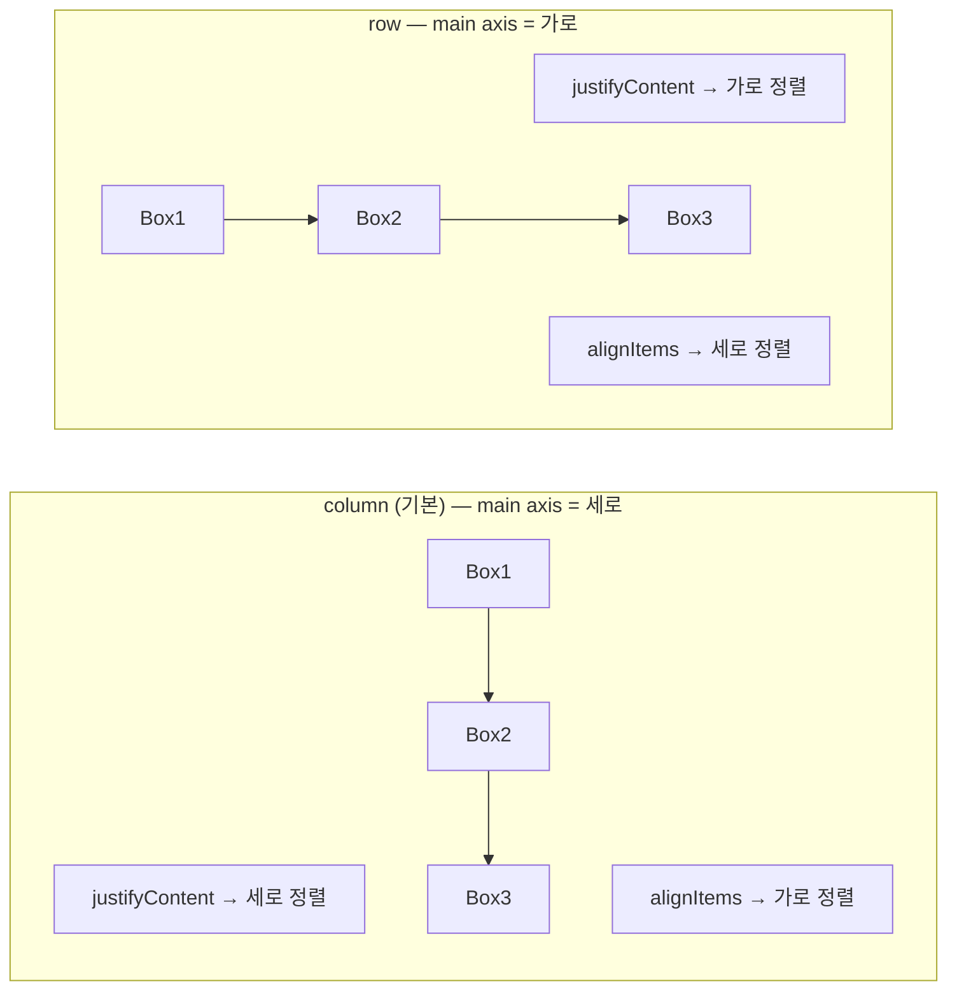
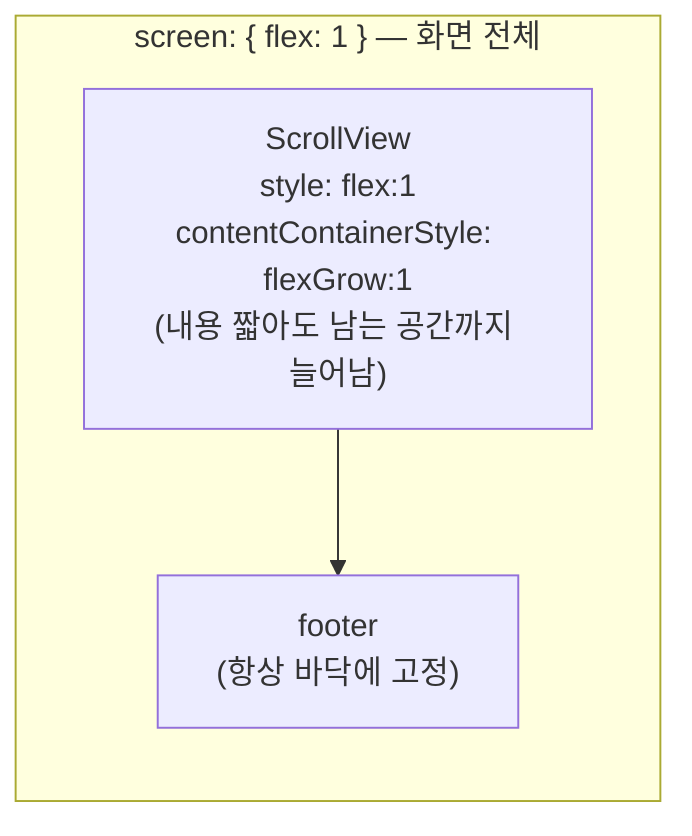
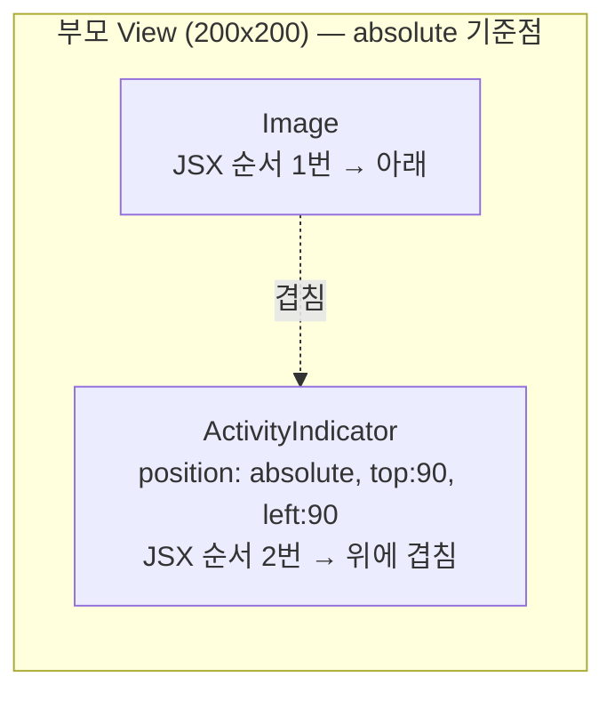

# P2 학습 가이드 — 레이아웃 & 스타일 실전

> 대상 실습: Flexbox 플레이그라운드 + 가로 카드. 개념은 현재 `App.tsx`의 실사용 스타일로 근거.
> 출처: [Flexbox](https://reactnative.dev/docs/flexbox) · [safe-area-context](https://docs.expo.dev/versions/v54.0.0/sdk/safe-area-context/) · [Platform](https://reactnative.dev/docs/platform-specific-code)
> 검증: rn-sandbox-app iOS 26.5 시뮬레이터 실측
> 핵심: **RN 레이아웃 = Flexbox 하나로 다 한다. 단 웹과 기본값·축이 다르다.**

---

## 1. 모든 View는 Flexbox, 기본 방향은 `column`

웹은 `display: block`이 기본이고 flex를 쓰려면 `display: flex`를 선언한다. **RN은 모든 View가 이미 Flexbox이고, `flexDirection`의 기본값이 `column`(세로)** 이다.

```
웹 기본:  block (세로로 쌓이지만 flex 아님)
RN 기본:  flex + column
웹에서 flex 기본: row
RN에서 flex 기본: column   ← 여기서 헷갈림
```

그래서 P1 프로필 카드에서 가로 배치를 하려면 명시했다:

```tsx
statsRow: { flexDirection: "row", gap: 32 },  // 세로 기본 → 가로로 바꿈
```

## 2. 축이 뒤바뀐 느낌 — justify vs align

기본 방향이 세로(column)라, **main axis = 세로, cross axis = 가로**.

| 속성             | column(기본)일 때 | row일 때  |
| ---------------- | ----------------- | --------- |
| `justifyContent` | **세로** 정렬     | 가로 정렬 |
| `alignItems`     | **가로** 정렬     | 세로 정렬 |

```tsx
content: { alignItems: "center" },  // column이라 alignItems가 "가로 중앙"
```

웹 flex(기본 row)에 익숙하면 justify/align이 반대로 느껴진다. **"main axis = flexDirection 방향"** 만 기억하면 헷갈리지 않는다.



## 3. `flex: 1` — 남은 공간 채우기

```tsx
screen: { flex: 1, backgroundColor: "#0f1115" },  // 화면 전체 채움
```

`flex: 1`은 "부모의 남은 공간을 다 차지". 화면 루트에 `flex: 1`을 줘야 배경이 전체를 덮는다. 현재 App.tsx의 sticky footer 패턴도 이걸로 만든다:

```tsx
// ScrollView가 flex로 자라서 footer를 바닥으로 밀어냄
<ScrollView contentContainerStyle={[styles.pad, { flexGrow: 1 }]} style={{ flex: 1 }}>
  ...내용...
</ScrollView>
<View style={styles.footer}>...버튼...</View>   // 항상 바닥
```



## 4. 단위 — 숫자는 dp, px 아님

```tsx
paddingVertical: 13,   // 13dp (밀도 독립 픽셀)
borderRadius: 12,
```

- 숫자 = **dp**. 기기 픽셀 밀도와 무관하게 물리적으로 비슷한 크기로 보임.
- `"50%"` 처럼 **문자열 %** 도 가능(부모 대비 비율).
- **반응형은 고정 px 대신** `flex`, `%`, 또는 `useWindowDimensions()`(런타임 화면 크기)로. 미디어쿼리가 없다.

## 5. SafeArea — 노치·홈 인디케이터 회피

기기 상단 노치/하단 홈바 영역을 피해야 UI가 안 가려진다. `react-native-safe-area-context`의 인셋을 쓴다.

```tsx
const insets = useSafeAreaInsets();
// 바닥 바에 홈 인디케이터 높이만큼 여백 추가
<View style={[styles.footer, { paddingBottom: insets.bottom + 12 }]}>
```

`insets`는 기기마다 다른 **동적 값** → StyleSheet(정적)에 못 넣고 inline으로 덧댄다. 이게 정적 스타일 + 동적 인셋을 배열로 합치는 실전 패턴.

## 6. 키보드 대응 — KeyboardAvoidingView

입력창이 키보드에 가려지지 않게 화면을 밀어올린다. **동작이 플랫폼별로 달라** `behavior`를 분기한다.

```tsx
<KeyboardAvoidingView
  behavior={Platform.OS === "ios" ? "padding" : "height"}
  keyboardVerticalOffset={headerHeight}
>
```

iOS는 `padding`, Android는 `height`가 자연스럽다. `Platform.OS`로 OS를 읽어 분기하는 게 RN의 기본 플랫폼 대응 방식.

### `behavior` 세 가지와 Android 생략 가능성

`behavior`는 `"height" | "position" | "padding"` 세 값을 받는다. `"position"`은 자식(주로 포커스된 입력창)의 위치만 옮기고 컨테이너 크기는 그대로 둬 레이아웃이 안 깨져야 하는 특수 케이스에 쓴다. iOS `padding`이 왜 되고 Android `height`가 왜 필요한지, 그리고 Android는 `windowSoftInputMode: adjustResize` 기본값 덕에 `behavior` 자체를 생략해도 되는 경우가 많다는 점은 [P6 §KeyboardAvoidingView](./p6-study-guide.md)에 정리되어 있다 — 여기선 중복 서술 안 함.

### `keyboardVerticalOffset` — 헤더 높이만큼 보정

`behavior="padding"`은 화면 **맨 아래**에서부터 키보드 높이를 계산한다. 그런데 네비게이션 헤더가 있으면 KeyboardAvoidingView는 헤더 아래부터 시작하니, 보정 없이는 그 헤더 높이만큼 과하게 밀어올린다. `keyboardVerticalOffset`이 그 오차를 빼주는 값이다. `ComposeScreen.tsx`가 실제로 이렇게 쓴다:

```tsx
const headerHeight = useHeaderHeight();

<KeyboardAvoidingView
  style={styles.screen}
  behavior={Platform.OS === "ios" ? "padding" : "height"}
  keyboardVerticalOffset={headerHeight ?? 0}
>
```

`@react-navigation/elements`의 `useHeaderHeight()`가 현재 화면의 실제 헤더 높이(px)를 돌려준다. 반대로 헤더가 없는 `LoginScreen.tsx`는 offset 없이 그냥 쓴다 — **보정할 헤더가 없으면 offset도 필요 없다**는 뜻.

### ScrollView와 같이 쓸 때

입력 필드가 여러 개라 스크롤이 필요하면 `ScrollView`를 KeyboardAvoidingView **안쪽**에 둔다(반대로 감싸면 키보드가 스크롤 영역까지 밀어올리지 못함). 이때 스크롤 중에도 버튼 탭이 먹게 하려면 `keyboardShouldPersistTaps="handled"`를 같이 준다 — 기본값(`"never"`)은 키보드가 떠 있는 동안 첫 탭을 키보드 닫기로만 소비한다.

```tsx
<KeyboardAvoidingView behavior={Platform.OS === "ios" ? "padding" : "height"}>
  <ScrollView keyboardShouldPersistTaps="handled">...입력 필드들...</ScrollView>
</KeyboardAvoidingView>
```

## 7. 절대 배치 & 겹치기

```tsx
// 이미지 위에 로딩 스피너를 겹침
<View style={{ width: 200, height: 200 }}>
  <Image ... />
  {isLoading && (
    <ActivityIndicator style={{ position: "absolute", top: 90, left: 90 }} />
  )}
</View>
```

- `position: "absolute"`는 **가장 가까운 부모 기준**(웹 `relative` 조상 지정 불필요, 부모가 기준이 됨).
- 겹침 순서 = **JSX 순서**(나중 요소가 위). 세밀한 제어는 `zIndex`(iOS) / `elevation`(Android).



## 8. 조건부·배열 스타일 (cascade 대용)

```tsx
style={({ pressed }) => [
  styles.btn,
  styles[`btn_${kind}`],       // 동적 키
  pressed && { opacity: 0.7 }, // 눌림 상태
  disabled && { opacity: 0.5 },
]}
```

상속·cascade가 없으니 **배열로 겹쳐** 표현한다. 뒤 요소가 앞을 덮어씀. `false`/`undefined`는 무시된다. Pressable은 `style`에 `({pressed}) =>` 함수를 줘 눌림 상태별 스타일도 가능.

---

## 웹 CSS → RN 매핑 요약

| 웹 CSS                                    | RN                                   |
| ----------------------------------------- | ------------------------------------ |
| `display: flex` 선언                      | 기본 적용(모든 View)                 |
| `flex-direction` 기본 `row`               | 기본 `column`                        |
| `px`, `em`, `rem`                         | dp(숫자), `%`(문자열)                |
| `@media`                                  | `useWindowDimensions()`              |
| 브라우저가 노치 처리                      | `useSafeAreaInsets()`                |
| `class` cascade                           | `style` 배열                         |
| `position: absolute` (조상 relative 필요) | 부모 기준 자동                       |
| `z-index`                                 | `zIndex`(iOS) / `elevation`(Android) |

## 복습 체크리스트

> 답이 막히면 위 해당 섹션으로. 코드를 안 보고 **말로 설명**할 수 있어야 통과.

- [ ] RN에서 `flexDirection` 기본값과, 웹 flex 기본값의 차이는? — [Flexbox](https://reactnative.dev/docs/flexbox)
- [ ] column일 때 `justifyContent`/`alignItems`는 각각 어느 축인가? — [Flexbox](https://reactnative.dev/docs/flexbox)
- [ ] `flex: 1`로 sticky footer를 어떻게 만드는가? — [Flexbox](https://reactnative.dev/docs/flexbox)
- [ ] RN 숫자 단위는 무엇이고 반응형은 어떻게 하나? — [`useWindowDimensions`](https://reactnative.dev/docs/usewindowdimensions)
- [ ] SafeArea 인셋을 StyleSheet가 아니라 inline으로 주는 이유는? — [safe-area-context](https://docs.expo.dev/versions/v54.0.0/sdk/safe-area-context/)
- [ ] KeyboardAvoidingView의 `behavior`를 왜 Platform으로 분기하나? — [`KeyboardAvoidingView`](https://reactnative.dev/docs/keyboardavoidingview) · [Platform](https://reactnative.dev/docs/platform-specific-code)
- [ ] `keyboardVerticalOffset`은 왜 필요하고, 헤더 없는 화면엔 왜 안 줘도 되나? — [`useHeaderHeight`](https://reactnavigation.org/docs/elements/#useheaderheight)
- [ ] cascade가 없는데 상태별 스타일을 어떻게 표현하나? — [`Pressable`](https://reactnative.dev/docs/pressable)

## 9. 짚고 넘어가면 좋은 것들

이름만 알아두면 필요할 때 바로 찾아 쓸 수 있는 개념들. P2에서 다루지 않았거나 언급만 하고 넘어감 — 지금 상세히 안 봐도 됨, 존재를 아는 게 목표.

- **[`LayoutAnimation`](https://reactnative.dev/docs/layoutanimation)** — §8 배열 스타일은 상태 변화가 즉시(스냅) 반영될 뿐, 부드러운 전환은 미다룸. [Animations](https://reactnative.dev/docs/animations) · [Reanimated](https://docs.expo.dev/versions/v54.0.0/sdk/reanimated/)
- **[`useWindowDimensions`](https://reactnative.dev/docs/usewindowdimensions)** — §4에서 언급만 하고 실제 태블릿/폰 breakpoint 분기 로직은 검증 안 함.
- **[`useColorScheme`](https://reactnative.dev/docs/usecolorscheme)** — 현재 코드베이스는 `#0f1115` 같은 색상을 하드코딩, 시스템 테마 감지는 미다룸. [Appearance](https://reactnative.dev/docs/appearance)
- **[Platform-Specific Code](https://reactnative.dev/docs/platform-specific-code)** — §6은 `Platform.OS` 삼항 분기만 다룸, `.ios.tsx`/`.android.tsx` 확장자로 파일 자체를 나누는 기준은 미다룸.
- **[gesture-handler](https://docs.expo.dev/versions/v54.0.0/sdk/gesture-handler/)** — §7 절대배치·겹치기는 정적 레이아웃, 스와이프/드래그 같은 제스처는 별도 라이브러리 필요.
- **[`StyleSheet.absoluteFill`](https://reactnative.dev/docs/stylesheet)**/`absoluteFillObject` — §7의 절대배치 예시(`position/top/left`)를 줄여주는 유틸리티를 아직 안 씀.
